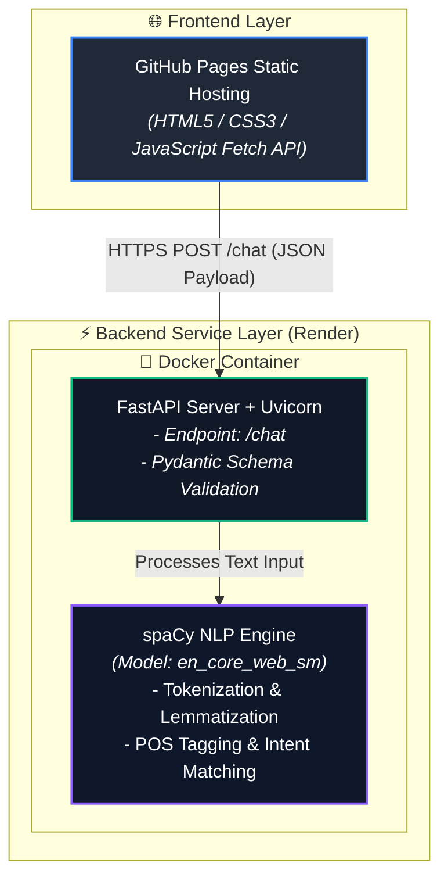

# 🤖 spaCy Conversational AI Chatbot

A lightweight, end-to-end web application that leverages **spaCy Natural Language Processing (NLP)** to classify user intents and return real-time responses through a **FastAPI** REST interface. The application is containerized with **Docker**, hosted on **Render**, and served globally via **GitHub Pages**.

---

## 🌐 Live Application Links

- **Frontend Interface (Live Chatbot):** [https://krishnegowda9.github.io/spacy-chatbot/](https://krishnegowda9.github.io/spacy-chatbot/)
- **Backend API Service:** [https://spacy-chatbot-app-latest.onrender.com](https://spacy-chatbot-app-latest.onrender.com)
- **Source Code Repository:** [https://github.com/krishnegowda9/spacy-chatbot](https://github.com/krishnegowda9/spacy-chatbot)

---

## 🏗️ System Architecture & Workflow
---


## 🔄 End-to-End Processing Flow

## 💬 Supported Inputs & Intent Rules

The chatbot processes user messages using tokenization, lemmatization, and phrase matching against configured intent patterns:

### **1. Intent Mapping Table**

| Intent Name | Example Input Queries | Bot Response |
| :--- | :--- | :--- |
| **Greeting** | `hi`, `hello`, `hey`, `greetings` | *"Hello!"*, *"Hi there!"*, *"Hey! How can I help you?"* |
| **Damodar Sir Info** | `damodar sir`, `who is damodar sir`, `who is damodar` | *"He is a great teacher."* |
| **Kannada Query** | `uta aytha`, `uta`, `oota aytha` | *"Hu aythu Nimdu"* |
| **Goodbye** | `bye`, `goodbye`, `see you later`, `exit` | *"Goodbye!"*, *"See you later!"*, *"Bye! Take care."* |
| **Thanks** | `thank you`, `thanks`, `appreciate` | *"You're welcome!"*, *"No problem!"*, *"Glad I could help!"* |
| **Fallback** | *Any unrecognized input* | *"I'm not sure I understand. Can you rephrase that?"* |

---

## 🔄 End-to-End Processing Workflow

1. **User Input:** A user types a message (e.g., *"who is damodar sir"*) into the web frontend hosted on **GitHub Pages**.
2. **API Request:** The frontend executes an asynchronous HTTP POST `fetch()` request sending JSON data `{"message": "who is damodar sir"}` to `https://spacy-chatbot-app-latest.onrender.com/chat`.
3. **NLP Processing Pipeline:**
   - **FastAPI** parses the JSON body into a `ChatRequest` model.
   - **spaCy Engine (`en_core_web_sm`)** processes text to generate `tokens`, `lemmas`, `POS tags`, and `entities`.
   - **Intent Matcher** checks clean message strings and lemmatized tokens against predefined keywords.
4. **Response Generation:** Matches the `damodar_info` intent and selects `"He is a great teacher."`
5. **UI Rendering:** Returns JSON payload with the response, which the frontend displays in the chat window.
---

## 🛠️ Tech Stack & Key Components

| Component | Technology | Purpose |
| :--- | :--- | :--- |
| **NLP Framework** | **spaCy** (`en_core_web_sm`) | Text processing, tokenization, intent matching |
| **Backend Framework** | **FastAPI** + **Uvicorn** | High-performance asynchronous REST API |
| **Frontend** | **HTML5**, **CSS3**, **JavaScript** | Responsive user interface using asynchronous Fetch API |
| **Containerization** | **Docker** & **Docker Hub** | Packaging application dependencies into an immutable image |
| **Cloud Hosting** | **Render Platform** | Running the Dockerized FastAPI service in the cloud |
| **Static Hosting** | **GitHub Pages** | Serving the global user frontend |

---

## 🚀 Local Development Setup

Follow these step-by-step commands to set up, run, and test the project locally on your machine:

### 1. Clone the Repository
```powershell
git clone [https://github.com/krishnegowda9/spacy-chatbot.git](https://github.com/krishnegowda9/spacy-chatbot.git)
cd spacy-chatbot
Set Up Virtual Environment

python -m venv venv
.\venv\Scripts\Activate

Install Dependencies & spaCy NLP Model
pip install -r requirements.txt
python -m spacy download en_core_web_sm

Run Backend Server (FastAPI + Uvicorn)
uvicorn main:app --reload

Launch Frontend Interface
python -m http.server 8080


##  Acknowledgments & Assessment Details

This project was developed as a college training assessment assigned and evaluated by our instructors:

- **Damodar Sir**
- **Akshay Sir**
- **Deeraj Sir**
